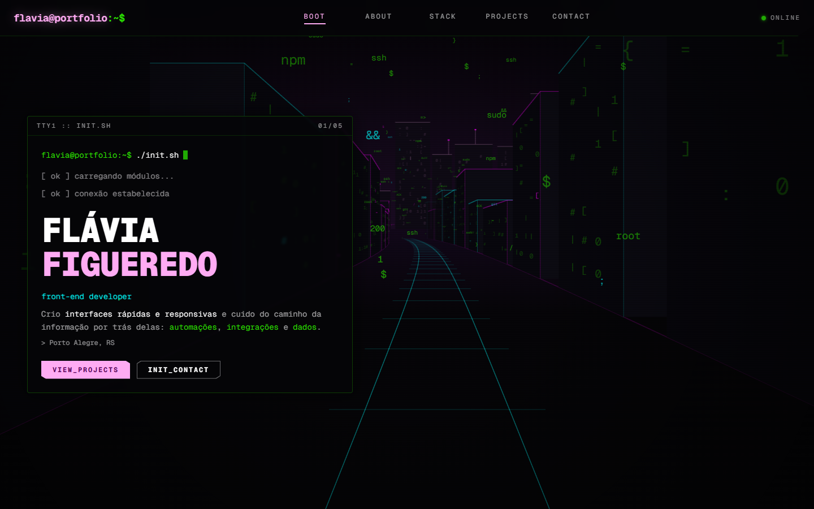
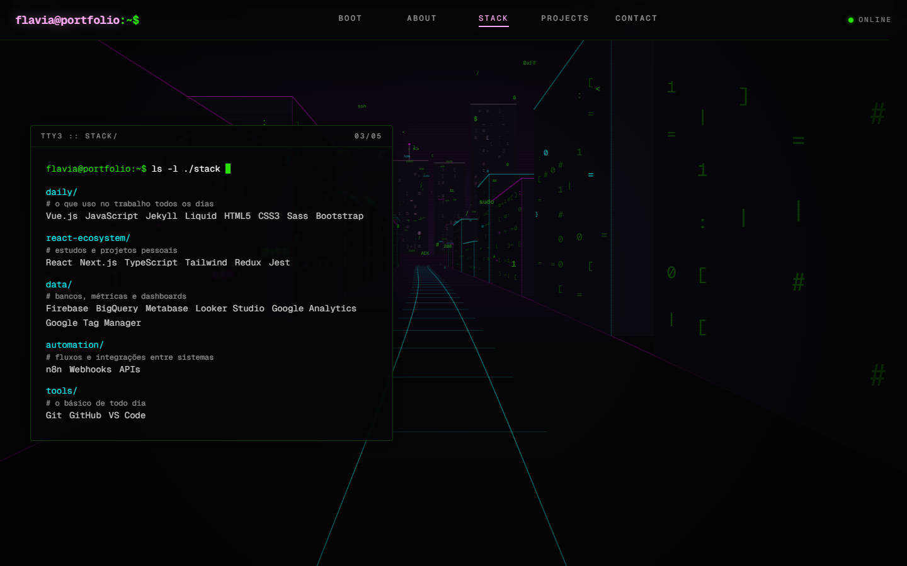
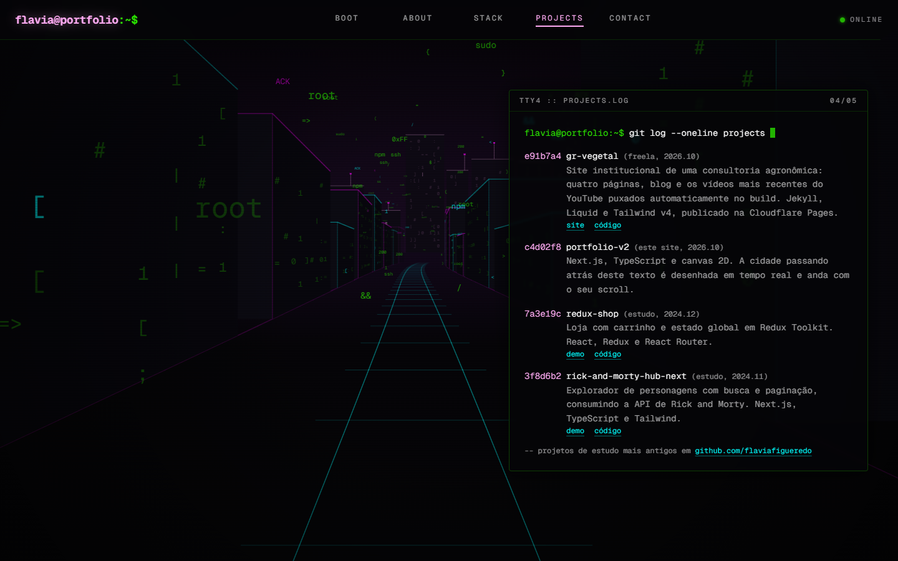
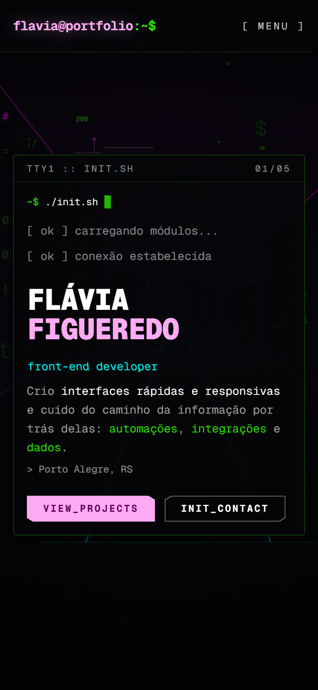
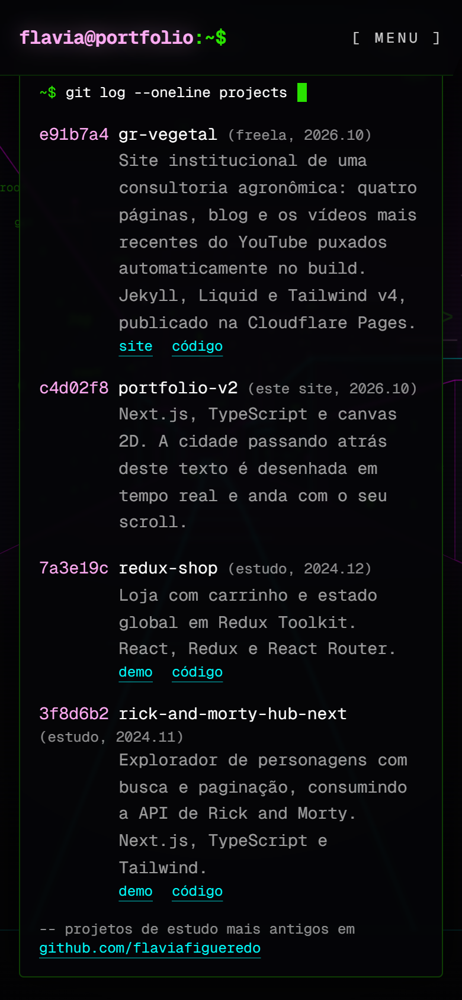

# flavia@portfolio:~$

Portfólio pessoal de **Flávia Figueredo**, desenvolvedora front-end em Porto Alegre.

**[flaviafigueredo.pages.dev](https://flaviafigueredo.pages.dev)**



## A ideia

Um portfólio com cara de terminal e clima cyberpunk. O fundo é uma cidade desenhada em tempo real: a câmera avança por uma rua entre prédios com janelas de caracteres, com trilhos no chão e a cidade distante no horizonte. Ela anda sozinha, devagar, e o scroll acelera a corrida (rolar pra cima volta).

O conteúdo aparece em painéis de terminal. Cada um "digita" um comando quando entra na tela (`cat about.md`, `ls -l ./stack`, `git log --oneline projects`) e mostra a resposta logo em seguida.

| Stack | Projetos |
| --- | --- |
|  |  |

<p align="center">
  
  
</p>

## Destaques técnicos

- **Cidade em canvas 2D, sem bibliotecas 3D.** A perspectiva é calculada à mão: cada ponto do mundo é projetado na tela pela distância até a câmera. Os prédios são gerados uma vez, numa fileira que se repete sem emenda, e a cidade do horizonte é desenhada num canvas fora da tela e só deslizada a cada quadro.
- **Glitch só com CSS.** O cargo no topo alterna entre português e inglês com um glitch, e os itens do menu viram português no hover. São duas cópias do texto (`::before` e `::after`) fatiadas com `clip-path`, sem JavaScript por quadro.
- **Site estático.** O Next.js exporta tudo como HTML, CSS e JS (`output: "export"`), publicado no Cloudflare Pages, sem servidor.
- **Acessibilidade.** Respeita "reduzir movimento" (o fundo deixa de andar sozinho e só se move com o scroll, e os deslizamentos e glitches somem), tem títulos de seção para leitores de tela, contorno de foco visível para quem navega pelo teclado (inclusive nos botões chanfrados, onde o `clip-path` cortaria o contorno) e contraste revisado.
- **E-mail protegido.** O endereço fica codificado e só é montado no navegador quando a pessoa clica em "mostrar e-mail", o que dificulta a coleta por robôs de spam.
- **Pronto pra compartilhar.** Imagem de compartilhamento, favicon, `sitemap.xml`, `robots.txt` e uma página 404 no estilo terminal.

## Stack

- [Next.js 16](https://nextjs.org) (App Router, exportação estática) com React Compiler
- [React 19](https://react.dev) e [TypeScript](https://www.typescriptlang.org)
- [Tailwind CSS v4](https://tailwindcss.com)
- [Framer Motion](https://motion.dev) para as animações dos painéis
- Canvas 2D API para o fundo
- [Cloudflare Pages](https://pages.cloudflare.com) para a hospedagem

## Rodando localmente

Precisa do Node 22 (a versão está no `.node-version`).

```bash
npm install
npm run dev
```

O site abre em `http://localhost:3000`.

Para gerar a versão de produção e testar do jeito que vai pro ar:

```bash
npm run build      # gera os arquivos estáticos na pasta out/
npx serve out      # serve a pasta out/ localmente
```

Como o site é exportado como arquivos estáticos, o `npm start` do Next não é usado neste projeto.

## Estrutura

```
src/
├── app/
│   ├── page.tsx              home: fundo da cidade + painéis de terminal
│   ├── layout.tsx            header, fonte e metadados (título, descrição, compartilhamento)
│   ├── not-found.tsx         página 404
│   ├── robots.ts, sitemap.ts
│   ├── icon.svg, apple-icon.png, opengraph-image.png
│   ├── globals.css           paleta, efeito de glitch e cantos chanfrados
│   └── lab/                  protótipos de fundo (tunnel, parallax, city)
├── components/
│   ├── background/           CityRun.tsx (o fundo) e funções de desenho
│   ├── sections/             Header.tsx e TerminalSections.tsx (os painéis)
│   └── lab/                  fundos alternativos usados só no /lab
├── content/
│   └── siteContent.ts        todo o conteúdo do site
└── hooks/
    └── useActiveSection.ts   descobre qual seção está na tela
public/
└── _headers                  cache e cabeçalhos de segurança do Cloudflare Pages
```

## Editando o conteúdo

Os textos do site (sobre, stack, projetos, contatos, título e descrição) ficam em [`src/content/siteContent.ts`](src/content/siteContent.ts). A frase de apresentação do topo fica em `TerminalSections.tsx`, porque tem palavras destacadas em cores.

A imagem de compartilhamento (`src/app/opengraph-image.png`) é um arquivo fixo. Se o nome ou o cargo mudarem, ela precisa ser refeita.

## Laboratório

Em `/lab` ficam os protótipos de fundo que vieram antes da versão final, guardados para testes e novas ideias:

- **`/lab/tunnel`**: um túnel de código em perspectiva, com trilhos no chão.
- **`/lab/parallax`**: uma cidade em camadas passando de lado, com um trem no trilho elevado.
- **`/lab/city`**: a mistura dos dois, que virou o fundo oficial.

Essas páginas não aparecem no Google (`noindex` e bloqueio no `robots.txt`).

## Publicação

O site é publicado no Cloudflare Pages com esta configuração:

| Campo | Valor |
| --- | --- |
| Framework preset | Next.js (Static HTML Export) |
| Build command | `npm run build` |
| Build output directory | `out` |

## Licença

Todos os direitos reservados. O repositório é público para consulta e avaliação do trabalho, mas o código, o design e os textos não podem ser copiados ou reutilizados sem autorização. Veja o arquivo [LICENSE](LICENSE).

## Contato

- GitHub: [github.com/flaviafigueredo](https://github.com/flaviafigueredo)
- LinkedIn: [linkedin.com/in/flaviafigueredo](https://www.linkedin.com/in/flaviafigueredo/)
